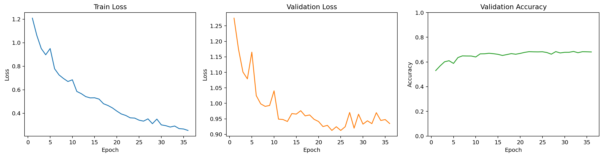
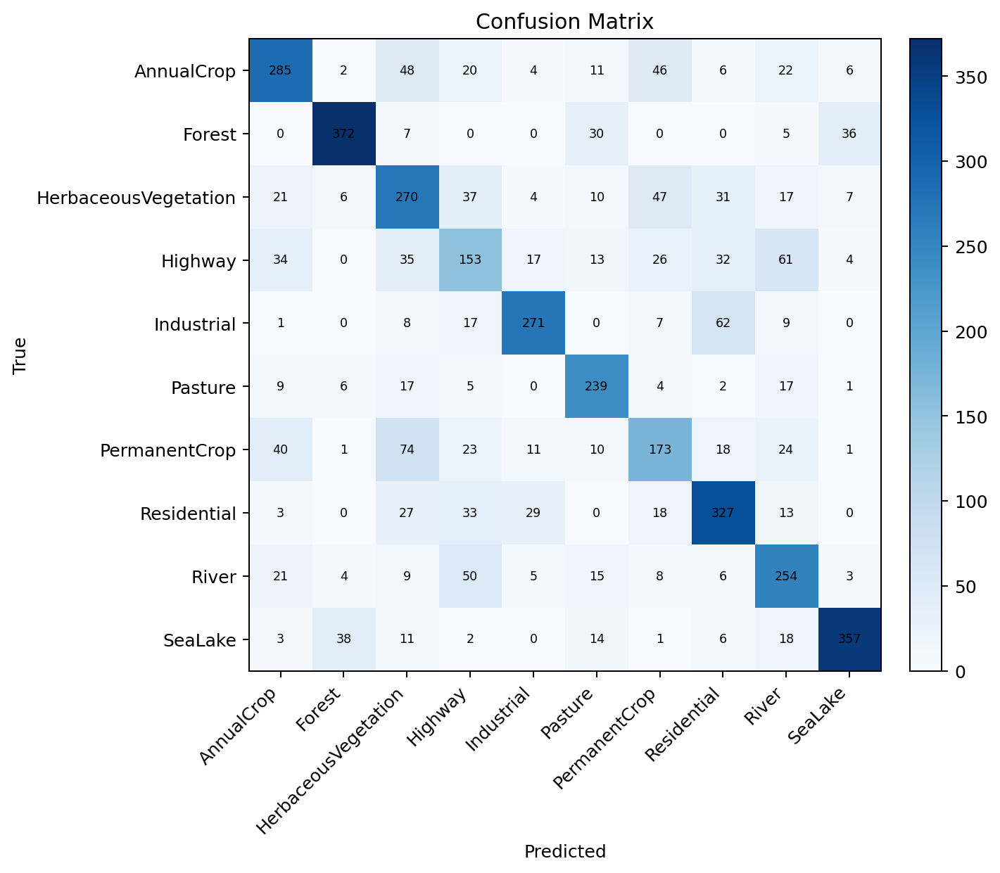
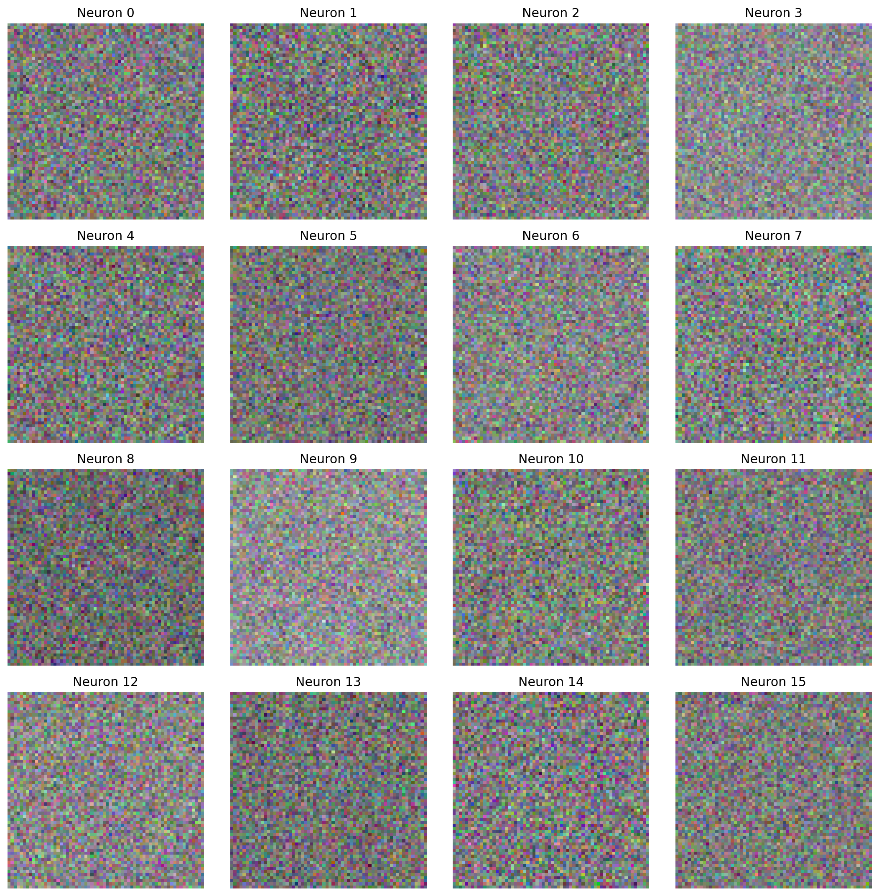
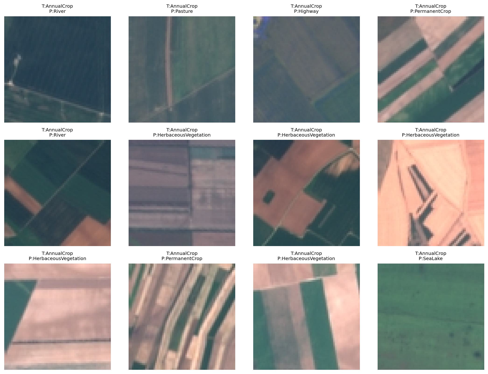

# HW1 实验报告（简写版）

## 1. 作业要求对齐

- 任务：在 EuroSAT RGB 数据集上实现十分类器。
- 模型：主体仍然是三层 MLP，结构为 `input -> hidden1 -> hidden2 -> output`。
- 实现约束：前向传播、Softmax 交叉熵、反向传播、SGD、学习率衰减、L2 正则和梯度裁剪均为手写实现，不依赖 PyTorch / TensorFlow / JAX 自动微分。
- 运行环境：远端 `135-3090-8`，环境 `/data/yc/miniconda/envs/llm-26-gpu`，训练后端固定为 `CuPy`。

## 2. 数据与实验设置

- 数据集：`EuroSAT_RGB`
- 划分方式：按类别分层划分，`train/val/test = 18900 / 4050 / 4050`
- 输入处理：将 `64x64x3` 图像展平，并使用训练集均值方差做标准化
- 选模标准：始终按验证集准确率保存最优权重

## 3. 正式提交模型

正式提交结果按验证集表现选择，而不是按测试集反选。

| 项目 | 数值 |
|---|---|
| 预设名 | `best` |
| 激活函数 | `relu` |
| 隐层宽度 | `1280 -> 768` |
| batch size | `256` |
| epoch | `36` |
| learning rate | `0.012` |
| lr decay | `0.01` |
| weight decay | `2e-4` |
| grad clip | `3.0` |
| 最佳 epoch | `32` |
| 最佳验证集准确率 | `0.6849` |
| 测试集准确率 | `0.6669` |

复现命令：

```bash
python -X utf8 "hw1/train.py" --preset best
```

## 4. 搜索与优化结果

| 实验 | hidden1 -> hidden2 | epoch | lr | decay | wd | clip | val acc | test acc | 说明 |
|---|---|---:|---:|---:|---:|---:|---:|---:|---|
| `trial_01` | `768 -> 512` | 28 | 0.010 | 0.03 | 5e-5 | 2.5 | 0.6659 | 0.6588 | 正式搜索中的基线 |
| `trial_02` | `1280 -> 768` | 28 | 0.012 | 0.01 | 2e-4 | 3.0 | 0.6837 | 0.6635 | 扩宽双隐层后明显提升 |
| `final_a` | `1280 -> 768` | 36 | 0.012 | 0.01 | 2e-4 | 3.0 | **0.6849** | 0.6669 | 按验证集选出的正式提交模型 |
| `final_b` | `1280 -> 1024` | 36 | 0.010 | 0.01 | 1e-4 | 3.0 | 0.6790 | 0.6704 | 更宽第二层提升了测试集，但验证集略退 |
| `final_c` | `1536 -> 768` | 32 | 0.010 | 0.01 | 1e-4 | 2.5 | 0.6815 | **0.6748** | 扩展实验中的最高测试精度 |
| `final_d` | `1536 -> 768` | 36 | 0.010 | 0.01 | 2e-4 | 2.5 | 0.6765 | 0.6684 | 继续训练后未继续提升 |

从这些结果可以看到：

- 只把 `768 -> 512` 扩到 `1280 -> 768`，验证集精度就从 `0.6659` 提升到 `0.6837`
- 在三层 MLP 不变的前提下，扩大第一隐藏层比盲目延长训练更有效
- `ReLU + 较小 lr 衰减 + 中等 weight decay + 轻量梯度裁剪` 是当前最稳定的组合
- `final_c` 的测试集更高，但因为验证集低于 `final_a`，所以不能把它当作正式提交模型，只能作为扩展实验说明“三层 MLP 的上限还可继续逼近”

## 5. 必要图表

### 5.1 训练曲线



### 5.2 混淆矩阵



### 5.3 第一层权重可视化



### 5.4 错例分析



## 6. 结果分析

正式提交模型 `final_a` 的分类别准确率如下：

| 类别 | acc |
|---|---:|
| AnnualCrop | 0.6333 |
| Forest | 0.8267 |
| HerbaceousVegetation | 0.6000 |
| Highway | 0.4080 |
| Industrial | 0.7227 |
| Pasture | 0.7967 |
| PermanentCrop | 0.4613 |
| Residential | 0.7267 |
| River | 0.6773 |
| SeaLake | 0.7933 |

现象总结：

- 最容易分类的是 `Forest`、`Pasture`、`SeaLake`，说明这几类在颜色纹理上更稳定
- 最难的是 `Highway` 和 `PermanentCrop`，这两类会和 `River`、`Residential`、`AnnualCrop`、`HerbaceousVegetation` 发生明显混淆
- `final_c` 虽然没有赢下验证集，但把 `AnnualCrop` 提升到 `0.7222`，把 `PermanentCrop` 提升到 `0.5307`，说明更大的第一隐藏层确实增强了模型对细粒度纹理差异的表达能力

## 7. 结论

- 在满足作业要求的前提下，当前这套三层 MLP 已经稳定达到 `66%+` 的测试精度，扩展实验最好达到了 `67.48%`
- 如果后续还要继续优化，优先方向仍然是“三层 MLP 内部”的宽度、训练轮数和正则组合，而不是跳到明显超出作业边界的新结构
- 因此，本次提交采用 `final_a` 作为正式模型，同时将 `final_c` 作为扩展实验展示模型上限
