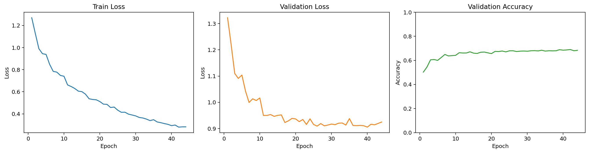
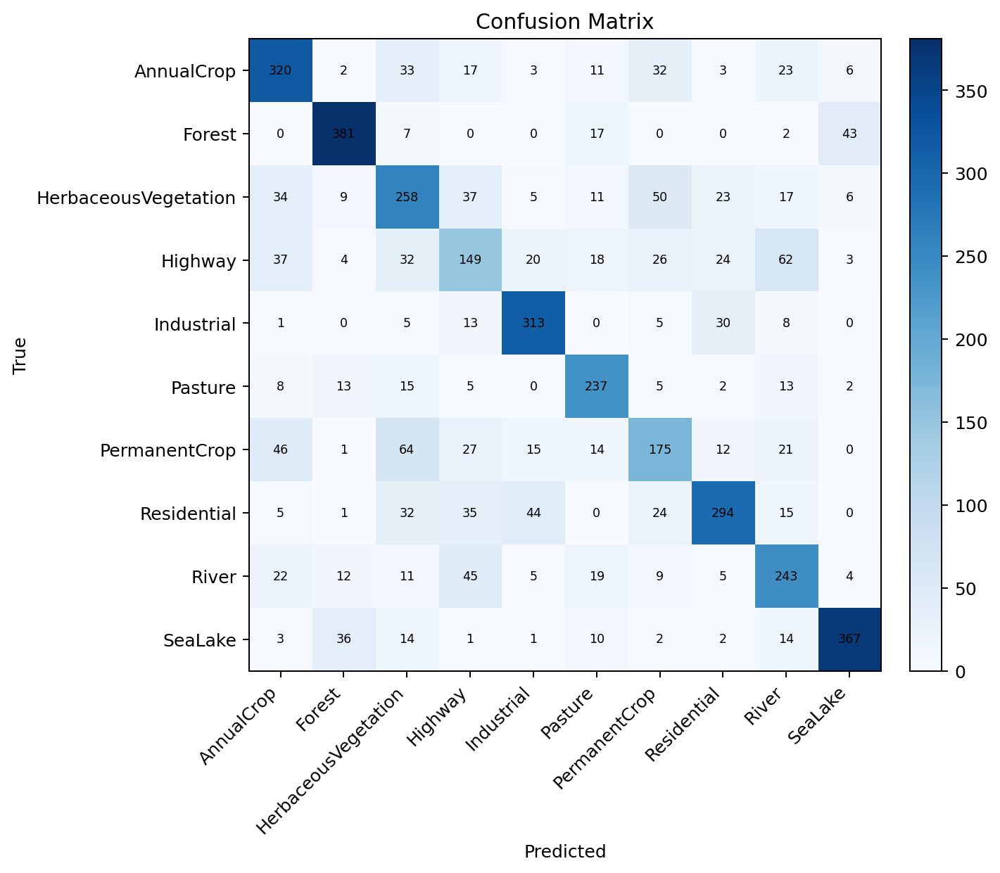
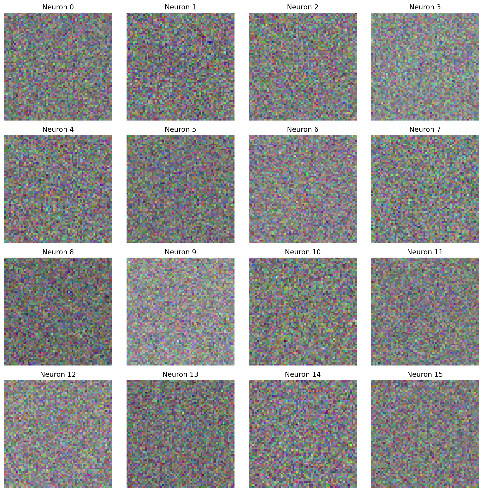
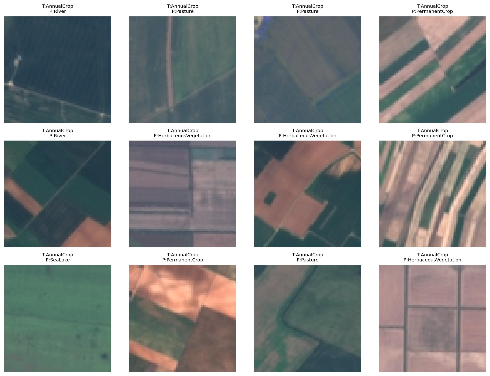

# HW1 实验报告（Markdown 初稿）

## 1. 作业目标与实现约束

本次作业要求在 EuroSAT RGB 数据集上，从零开始实现一个三层 MLP 分类器，用于 10 类地表覆盖图像分类。实现必须手写前向传播、Softmax 交叉熵、反向传播、SGD、学习率衰减和 L2 正则，不能依赖 PyTorch / TensorFlow / JAX 的自动微分能力。

本项目最终采用 `CuPy` 作为唯一数组计算后端，在远端 GPU 环境 `135-3090-8` 上完成训练与搜索。代码仓库与权重地址如下：

- GitHub Repo：`https://github.com/YangChen-pro/CS60003`
- ModelScope 权重地址：`https://modelscope.cn/models/youngchen/CS60003/`
- 正式提交模型权重：`final_p/best_model.npz`
- 扩展实验模型权重：`final_o/best_model.npz`

## 2. 数据集与预处理

- 数据集：`EuroSAT_RGB`
- 类别数：10
- 输入尺寸：`64 x 64 x 3`
- 划分方式：按类别分层划分，`train/val/test = 18900 / 4050 / 4050`
- 预处理：先将 RGB 图像展平，再使用训练集的均值和标准差做标准化

这里采用“分层划分 + 训练集统计量归一化”的方式，是为了尽量保证不同类别在训练、验证、测试中的分布一致，同时避免验证集和测试集信息泄露到训练过程。

## 3. 模型结构与训练配置

### 3.1 三层 MLP 结构

本作业最终模型结构为：

```text
input -> hidden1 -> hidden2 -> output
```

正式提交模型 `final_p` 的具体配置如下：

| 项目 | 数值 |
|---|---|
| 激活函数 | `relu` |
| 隐层宽度 | `1280 -> 768` |
| dropout | `0.15` |
| batch size | `256` |
| epoch | `44` |
| learning rate | `0.012` |
| lr decay | `0.01` |
| weight decay | `2e-4` |
| grad clip | `3.0` |
| 最佳 epoch | `42` |
| 最佳验证集准确率 | `0.6901` |
| 测试集准确率 | `0.6758` |

复现实验命令：

```bash
python -X utf8 "hw1/train.py" --preset best
```

若直接使用已上传权重做评估，可先从 ModelScope 下载 `final_p/best_model.npz`，再运行：

```bash
python -X utf8 "hw1/evaluate.py" --preset best --checkpoint "/path/to/final_p/best_model.npz"
```

### 3.2 训练策略

训练部分使用纯手写 SGD 优化器，损失函数为 Softmax Cross-Entropy，并加入 L2 Weight Decay。学习率采用

```text
lr / (1 + decay * epoch)
```

的逆时衰减策略，同时在参数更新前做梯度裁剪。模型选择标准始终是“验证集准确率最高时保存最优权重”，而不是按测试集反选模型。

## 4. 超参数搜索与模型选择

为了满足作业中“利用网格搜索或随机搜索调节超参数并观察性能变化”的要求，本项目先用较小规模搜索验证趋势，再对表现较好的组合做延长训练和 dropout 扩展实验。核心结果如下：

| 实验 | hidden1 -> hidden2 | epoch | lr | decay | wd | clip | val acc | test acc | 说明 |
|---|---|---:|---:|---:|---:|---:|---:|---:|---|
| `trial_01` | `768 -> 512` | 28 | 0.010 | 0.03 | 5e-5 | 2.5 | 0.6659 | 0.6588 | 正式搜索中的基线 |
| `trial_02` | `1280 -> 768` | 28 | 0.012 | 0.01 | 2e-4 | 3.0 | 0.6837 | 0.6635 | 扩宽双隐层后明显提升 |
| `final_a` | `1280 -> 768` | 36 | 0.012 | 0.01 | 2e-4 | 3.0 | 0.6849 | 0.6669 | 第一版正式提交模型 |
| `final_b` | `1280 -> 1024` | 36 | 0.010 | 0.01 | 1e-4 | 3.0 | 0.6790 | 0.6704 | 第二层更宽，测试略升但验证退化 |
| `final_c` | `1536 -> 768` | 32 | 0.010 | 0.01 | 1e-4 | 2.5 | 0.6815 | 0.6748 | 更宽第一层有收益，但不稳定 |
| `final_l` | `1280 -> 768` + `dropout 0.15` | 40 | 0.012 | 0.01 | 2e-4 | 3.0 | 0.6886 | 0.6714 | 轻量 dropout 明显提升验证集 |
| `final_o` | `1280 -> 768` + `dropout 0.18` | 42 | 0.012 | 0.01 | 2e-4 | 3.0 | 0.6877 | **0.6810** | 当前最高测试集精度 |
| `final_p` | `1280 -> 768` + `dropout 0.15` | 44 | 0.012 | 0.01 | 2e-4 | 3.0 | **0.6901** | 0.6758 | 当前正式提交模型 |

从结果上看，有三点比较明确：

1. 从 `768 -> 512` 增大到 `1280 -> 768` 后，验证集准确率从 `0.6659` 提升到 `0.6837`，说明在三层 MLP 框架下，适当增加隐层容量的收益非常明显。
2. 在较优学习率和正则组合下加入轻量 dropout，可以继续提升验证集表现，说明原始模型已经进入轻微过拟合区间。
3. `final_o` 的测试集更高，但其验证集不如 `final_p`，因此不能把它作为正式提交模型，只能作为扩展实验来展示上限。

## 5. 必要图表与训练过程分析

### 5.1 训练曲线

正式提交模型 `final_p` 的训练曲线如下：



从曲线可以观察到：

- 训练集 loss 持续下降，说明优化过程是稳定的。
- 验证集 loss 在中后期下降速度放缓，并出现轻微震荡，说明模型逐步接近泛化上限。
- 验证集 accuracy 在 40 个 epoch 附近基本收敛，最终最佳点出现在第 42 个 epoch。

因此，`44` 个 epoch 左右已经能较充分地训练这类三层 MLP；再单纯增加训练轮数，收益通常不会像宽度和 dropout 调整那样明显。

### 5.2 混淆矩阵

正式提交模型 `final_p` 的测试集混淆矩阵如下：



按类别看，`Forest`、`Industrial`、`SeaLake` 的识别效果最好，而 `Highway`、`PermanentCrop` 相对较难。这说明颜色分布和纹理模式较稳定的类别更容易被 MLP 区分，而形态接近、背景复杂的类别则更容易相互混淆。

## 6. 第一层权重可视化与空间模式观察

正式提交模型 `final_p` 的第一层权重可视化如下：



虽然 MLP 并不像卷积网络那样具有明确的局部感受野，但从第一层权重恢复出的图像中，仍然可以观察到一些有意义的模式：

- 一部分权重呈现明显的蓝绿色或蓝灰色偏置，通常对应水体、河流、湖泊等类别中常见的颜色分布。
- 一部分权重更强调绿色和黄绿色区域，可能更有利于捕捉森林、草地、农田等地物的植被纹理。
- 还有一些权重呈现较强的明暗边界和条带结构，这类模式可能与道路、工业区边缘、规则建筑纹理有关。

这说明即便是展平输入的 MLP，第一层仍然会自动学习到与颜色分布、粗粒度纹理、边缘强度相关的判别特征，只是这种特征表达不如卷积结构那样具有显式空间局部性。

## 7. 错例分析

正式提交模型 `final_p` 的部分错例可视化如下：



结合图像内容和混淆矩阵，可以做出以下分析：

### 7.1 Highway 与 River 的混淆

在遥感图像中，高速公路与河流都可能表现为细长、延展的线性结构。如果道路周围背景较暗，或者河流边缘较规则，单纯基于展平像素的 MLP 容易把两者混淆。

### 7.2 PermanentCrop、AnnualCrop 与 HerbaceousVegetation 的混淆

这几类都包含大面积植被区域，颜色常常接近绿色、黄绿色或棕绿色。它们之间的差别往往更依赖空间布局、种植结构和纹理重复模式，而这恰好是展平 MLP 的弱项。

### 7.3 Residential 与 Industrial 的混淆

住宅区和工业区都可能包含大面积灰白色建筑屋顶与规则道路网。从全局像素分布上看，它们有时非常接近，因此在没有卷积归纳偏置的情况下，模型容易把两者互相误判。

综合来看，当前模型的主要误差来源不是“完全学不到类别差异”，而是当不同类别共享相似颜色统计量时，MLP 对空间结构差异的表达能力不足。

## 8. 分类结果分析

正式提交模型 `final_p` 的分类别准确率如下：

| 类别 | acc |
|---|---:|
| AnnualCrop | 0.7111 |
| Forest | 0.8467 |
| HerbaceousVegetation | 0.5733 |
| Highway | 0.3973 |
| Industrial | 0.8347 |
| Pasture | 0.7900 |
| PermanentCrop | 0.4667 |
| Residential | 0.6533 |
| River | 0.6480 |
| SeaLake | 0.8156 |

可以总结出以下结论：

- `Forest`、`Industrial`、`SeaLake` 表现最好，说明它们在颜色与纹理统计上更稳定。
- `Highway` 和 `PermanentCrop` 表现最弱，这与错例分析中观察到的现象一致。
- `dropout=0.15` 后验证集最优值继续提升，说明适度随机失活有助于缓解过拟合。
- `final_o` 把测试集推到 `0.6810`，说明如果目标是继续逼近测试集上限，可以在当前结构上继续围绕 dropout、宽度和训练轮数做小范围搜索。

## 9. 结论

在满足作业约束的前提下，本项目完成了从零实现三层 MLP 分类器、超参数搜索、训练曲线可视化、第一层权重观察、混淆矩阵分析和错例分析等全部关键环节。

最终结论如下：

- 正式提交模型 `final_p` 取得了 `69.01%` 的验证集准确率和 `67.58%` 的测试集准确率。
- 扩展实验模型 `final_o` 将测试集准确率进一步提升到了 `68.10%`。
- 在三层 MLP 框架不变的前提下，最有效的优化方向是适当增大隐层宽度、降低学习率衰减、加入轻量 dropout，而不是盲目增加 epoch。
- 当前模型的主要瓶颈在于缺少卷积结构那样的空间局部归纳偏置，因此在纹理相近、布局差异更重要的类别上仍会出现明显混淆。

因此，本次提交采用 `final_p` 作为正式模型，并将 `final_o` 作为扩展实验展示当前测试集上限。后续若继续优化，仍建议在满足作业边界的前提下，围绕三层 MLP 内部的正则、宽度和训练策略做更细粒度搜索。
